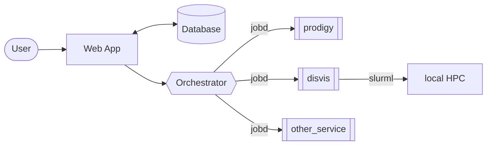

# `jobd` (Job Daemon)


[](https://github.com/rvhonorato/jobd/actions/workflows/ci.yml)
[](https://app.codacy.com/gh/rvhonorato/jobd/dashboard?utm_source=gh&utm_medium=referral&utm_content=&utm_campaign=Badge_grade)
[](https://app.codacy.com/gh/rvhonorato/jobd/dashboard?utm_source=gh&utm_medium=referral&utm_content=&utm_campaign=Badge_coverage)

This is a central component [WeNMR](https://wenmr.science.uu.nl), a worldwide
e-Infrastructure for NMR and structural biology - operated by
the [BonvinLab](https://bonvinlab.org) at the [Utrecht University](https://uu.nl).

It enables interaction between the web backend and the
[research software developed in the Bonvinlab](https://github.com/haddocking) which
are offered as web services for a community of over
[52.000 users accross 154 countries](https://rascar.science.uu.nl/new/stats).

`jobd` is a lightweight Golang application designed to facilitate interaction with
research software through REST APIs. It is specifically engineered to be deployed
in multi-stage Docker builds, providing a flexible and portable solution for job
management and file transfer.



🚧 Documentation is still a work in progess 🚧

## Features

Implements two primary REST API endpoints:

- `POST /api/upload` Allows backend systems or scripts to upload files to the container
- `GET /api/get/:id` Enables retrieval of files (results) from the container

Check the [API docs](https://rvhonorato.github.io/jobd/) for more information

Use Cases

- Microservice-based job submission and file handling
- Simplified API interfaces for research software workflows

## Usage

The purpose of `jobd` is to be an adapter to allow backend/scripts to interact with
_any_ sort of command-line based application.

It takes a base64 encoded `.zip` file that **must** contain a `run.sh` script.

Once a `POST` request is made to `/api/upload`, `jobd` creates an entry in its
micro(embedded) database and saves the `input` to disk (inside the container).

It will check every second for tasks that are `QUEUED` in the database, then
make a system call to the `run.sh` script and report its exit code.

All the resulting contents are then compressed (also base64 `.zip`) and
returned as the `output`.

### Example

> ⚠️ `jobd` was not designed for this type of interaction, but rather via automated
> scripts. The workflow below is just to demonstrate how it works.

[PRODIGY](https://github.com/haddocking/prodigy) is a command-line application
to calculate binding energies between proteins, developed by the BonvinLab.
It takes as input a single protein structure and is executed simply with:

```bash
prodigy input.pdb
```

This application can be installed from `pip`, see below how we can containerize
`prodigy` and add `jobd` as the interface.

```dockerfile
FROM ubuntu:latest AS build

RUN pip install prodigy

# Here you could also clone a repository and install it;
## WORKDIR /src/app
## RUN git clone https://github.com/username/code . && \
##  bash install.sh ## or pip install, or anything like that

# Get `jobd` from the github image repository
FROM ghcr.io/rvhonorato/jobd:latest AS jobd

WORKDIR /data
COPY --from=jobd /jobd /bin/jobd

ENTRYPOINT [ "/bin/jobd" ]
```

After building and running this image, you can then interact with the container
via its [APIs](https://rvhonorato.me/jobd).

Then prepare the payload, it must contain the `run.sh` file and the input files.

- `run.sh` file:

  ```bash
  #!/bin/bash

  prodigy input.pdb

  # any other steps you want to add here
  ```

Prepare the payload;

```bash
# Make a zip file called `files.zip`
$ zip files.zip run.sh input.pdb
```

Then prepare the input `.json` file - it is expected to be in the following format:

```json
{
  "id": "name-of-my-job",
  "input": "BASE64_STRING_HERE"
}
```

This can easily be done with more scripting (or using any other method)

```bash
jq -n --arg id "name-of-my-job" --arg input "$(base64 files.zip)" \
   '{id: $id, input: $input}' > job.json
```

Finally submit the job to the container:

```bash
curl -X POST http://your.server:8080/api/upload \
     -H "Content-Type: application/json" \
     -d @job.json
```

And later download the results by making a `GET` request to `/api/get/name-of-my-job`

## Setup

The application is optimized for containerized environments,
supporting multi-stage build patterns or simple binary execution.

In both ways the `jobd` version can be passed as a build argument:

```bash
docker build --build-arg JOBD_VERSION=v0.1.0 .
```

### Multi-stage build

First stage pulls the jobd executable from a specific image
Second stage incorporates the executable into a base research container
Enables seamless integration of job management capabilities into existing research
software containers

```dockerfile
ARG JOBD_VERSION=latest
FROM ghcr.io/rvhonorato/jobd:${JOBD_VERSION} AS jobd

FROM ghcr.io/haddocking/arctic3d:v0.5.1 AS base

WORKDIR /data
COPY --from=jobd /jobd /bin/jobd

ENTRYPOINT [ "/bin/jobd" ]
```

### Binary execution

```dockerfile
FROM ghcr.io/haddocking/arctic3d:v0.5.1
WORKDIR /data

ARG JOBD_VERSION=v0.1.0
ARG JOBD_ARCH=linux_386

# Download and extract jobd binary
ADD https://github.com/rvhonorato/jobd/releases/download/${JOBD_VERSION}/jobd_${JOBD_VERSION}_${JOBD_ARCH}.tar.gz /tmp/
RUN tar -xzf /tmp/jobd_${JOBD_VERSION}_${JOBD_ARCH}.tar.gz -C /bin/ \
    && chmod +x /bin/jobd \
    && rm /tmp/jobd_${JOBD_VERSION}_${JOBD_ARCH}.tar.gz

ENTRYPOINT [ "/bin/jobd" ]
```

## Key points
- Language: Golang
- Type: Lightweight REST API-based job management microservice
- Primary Purpose: Facilitate interaction between web backends and research software
- Containerization-native design
- Embedded microdatabase for job tracking
- Polls database every second for QUEUED tasks
- Executes run.sh script via system call
- Captures and reports script exit code
- Compresses and returns job results
- Multi-stage Docker builds
- Direct binary execution
- Research computing platforms
- Microservice architectures
- Scientific software workflows
- Minimal system overhead
- Flexible integration with research software

## Contact

If you think this project would be useful for your use case or would like to suggest something, please reach out either via issue here or via email. (:
